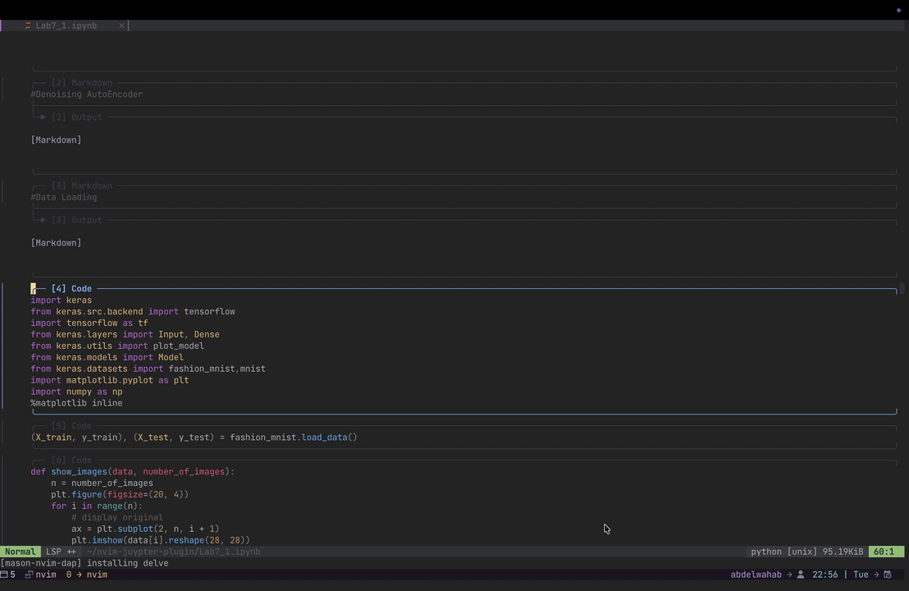

# 🪐 nvim-jupyter

An interactive, fully-featured Jupyter Notebook client for Neovim. Edit `.ipynb` files directly with seamless kernel integration, inline image rendering, local variable tracking, and built-in undo trees.




---

## ⚡ Features

- **Native `.ipynb` Editing**: Work directly inside Jupyter Notebook files without messy conversions.
- **Inline Image Rendering**: View Matplotlib and Seaborn plots natively inside Neovim (powered by `image.nvim`).
- **Interactive Outputs**: Print pandas DataFrames and textual outputs directly below your code cells.
- **Variable Explorer**: A global sidebar to track your workspace variables in real-time.
- **Local Cell Variables**: Isolate and inspect variables specific to the current cell you are editing.
- **Notebook & Cell Undo Trees**: Never lose your work. Powerful undo branches for both the entire notebook and individual cells.
- **LSP Bridge**: Enjoy full Python autocomplete and diagnostics inside notebook cells.

## 📦 Requirements

- **Neovim** 0.10+
- **Python 3**
- `pip install jupyter_client tabulate`
- **ImageMagick** (Required for cropping and scaling plots)
- [image.nvim](https://github.com/3rd/image.nvim) (Optional, but highly recommended for inline graphics)

## 🚀 Installation

Install using [lazy.nvim](https://github.com/folke/lazy.nvim):

```lua
{
    "abdelwahab-7/nvim-jupyter",
    lazy = false, -- Must be false so BufReadCmd can intercept .ipynb files on open
    dependencies = {
        "3rd/image.nvim", -- Optional for inline images
    },
    config = function()
        require("nvim_jupyter").setup({
            -- Add your custom options here
        })
    end
}
```

## ⚙️ Configuration

`nvim-jupyter` works out of the box, but you can override the defaults in the `setup()` function:

```lua
require("nvim_jupyter").setup({
  -- Handle HTML outputs as Images (macOS only, requires qlmanage)
  render_html_as_image = false,

  -- Clean up temporary images in /tmp/ when closing Neovim
  clean_tmp_files_on_exit = true,

  -- Keybindings (these are the defaults)
  keymaps = {
    run_current_cell = "<leader>rc",
    run_all = "<leader>ra",
    cancel_current_cell = "<leader>kc",
    interrupt_execution = "<leader>ka",
    run_cells_above = "<leader>ru",
    run_cells_below = "<leader>rd",
    add_cell_below = "<leader>bt",
    toggle_variable_explorer = "<leader>ve",
    toggle_local_variables = "<leader>lv",
    toggle_undo_tree = "<leader>ut",
    toggle_local_undo = "<leader>lu",
  },
})
```

## 📖 Usage

Simply open a `.ipynb` file in Neovim. The background Python kernel will start automatically.

### Navigation & Modes
The plugin features two primary modes when editing a `.ipynb` file, which you can toggle by pressing `<Esc>`.

#### 1. Global Normal Mode
*This is the default mode for safely navigating between cells without accidentally modifying them.*
- **`j` / `k`**: Jump to the next or previous cell block.
- **`l`**: Toggle visibility of the current cell's output (hide/show output).
- **`dd`**: Delete the current cell block entirely.
- **`i` / `a`**: Disabled. This protects you from accidentally typing or messing up the notebook structure outside of code cells.

#### 2. Local Edit Mode
*This mode allows you to edit the code inside a specific cell.*
- **`l`**: Works exactly like standard Vim motion (moves the cursor right).
- **`i` / `a`**: Enters standard Insert Mode so you can write Python code.
- **`<leader>rc`**: Run the current cell.

### Sidebars (Undo Tree & Variable Explorers)
The plugin comes with powerful sidebars for variables and undo history. Here is how you interact with them:

- **Variable Explorers** (`<leader>ve` for global, `<leader>lv` for local):
  - These are read-only sidebars displaying your variables. Standard Vim motions (like `j`, `k`, `h`, `l`) work as expected for moving around the list.
- **Undo Trees** (`<leader>ut` for global, `<leader>lu` for local):
  - **`j` / `k`**: Navigate up and down the history tree.
  - **`l`**: Preview the code state for the selected history node.
  - **`r`**: Restore the cell/notebook to the selected state.
  - **`s`**: Toggle selection of a specific state.
  - **`<CR>`**: Apply the selected state.
  - **`q` or `<Esc>`**: Close the Undo Tree sidebar.

Run `:checkhealth nvim_jupyter` to verify your installation!
